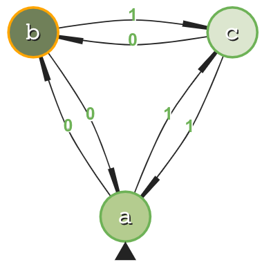

<div align="center">
	 
</div>

# DFA CLI

CLI for executing automatons.

Designed to be run with [Deno](https://deno.land/):
```
deno run index.ts
```

Future work will focus on the construction of graphs programatically or reading in from a file. For the time being, a JSON file is loaded with the following structure:

```json
{
	"dfa": {
		"A": {
			"edges": [
				{
					"target": "B",
					"input": "1"
				},
				{
					"target": "C",
					"input": "0"
				}
			],
			"accepting": false
		},
		"B": {
			"edges": [
				{
					"target": "A",
					"input": "0"
				},
				{
					"target": "C",
					"input": "1"
				}
			],
			"accepting": false
		},
		"C": {
			"edges": [
				{
					"target": "B",
					"input": "0"
				},
				{
					"target": "A",
					"input": "1"
				}
			],
			"accepting": true
		}
	},
	"start": "A"
}
```

Processing the input string:

```typescript
automaton.process('010')
```

will yield:

```typescript
{ path: [ "C", "A", "C" ], accepted: true }
```